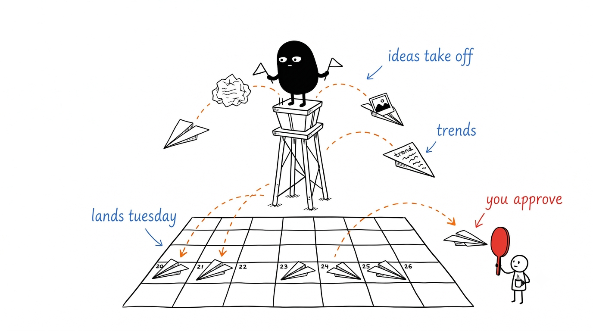
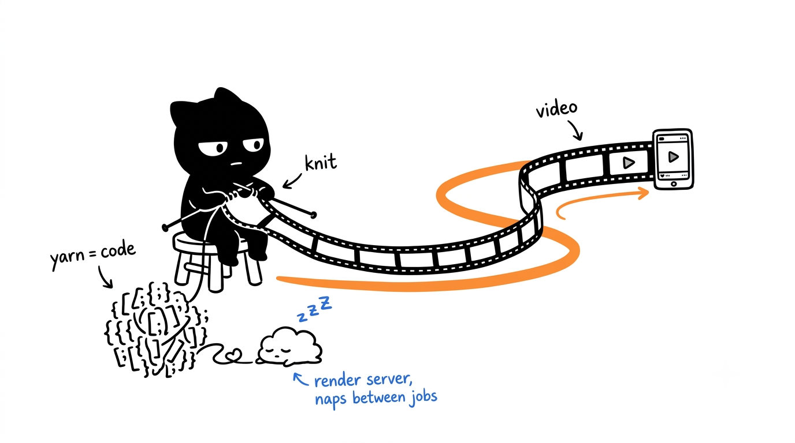

# Postique: AI Marketing Employee

For the past month I have been building Postique, our AI marketing employee. An employee with an actual morning routine: it wakes up before me, rereads its feedback diary, checks what is happening in our space, plans topics against our strategy, writes posts for every channel in that channel's native format, makes the videos, runs its own QA, and lays everything out on a calendar for me to approve.

It currently runs social for our brand, the one whose blog you are reading right now.

## Why did we even need this?

Because marketing is the job everyone at a small company agrees is important and nobody actually does. The ideas live in someone's phone notes. The photos are scattered across four devices. Somebody posts three times in one week, feels great about it, and then the account goes quiet for a month. Consistency is the entire game on social media, and consistency is exactly what busy humans are worst at.

An AI employee does not get bored, does not forget the strategy, and does not skip Tuesday because Tuesday was chaotic. The plan shows up whether you had a good week or not. That alone changed more than any single clever feature.

## Okay, but why not just use ChatGPT?

This is the question I get most, and it is a fair one, because the writing itself is not the hard part. Any good model can write a decent caption if you feed it the right context. The difference is everything around the writing.

When you use a chat window, you are the pipeline. You bring the idea, you paste the brand voice, you ask for the post, you fix the tone, you find a photo, you pick a time, and next week you do all of it again from a blank page, because the chat forgot everything. The model is smart and the workflow has the memory of a goldfish.

Postique flips that. It knows what we already published, so it does not pitch the same topic twice. It knows which channels are active and writes natively for each one, because a LinkedIn post and a TikTok script have nothing in common. It knows our actual voice, not from adjectives I wrote, but from real posts by real humans on our team that it studies as examples. It knows the strategy, so a founder idea I type on Monday outranks whatever the internet is trending on Tuesday. And when I reject a draft, that click is not a dead end. It becomes data.

One honest note here: the model alone was not smart enough for any of this. Early Postique confidently decided a brand with exactly one published post was a well-established account, because it had adapted that one post into eight channel versions and counted them as eight pieces of history. Fluent writing, kindergarten math. Every important rule in the system eventually moved out of the prompts and into real code that checks the model's work. The model proposes, code verifies, a human decides.

## It learns from every "no"

This is the part I am most proud of. Every rejection comes with a one-tap reason: off-brand, boring, sounds like AI, wrong facts, bad topic. Every manual edit gets stored as a diff. There is even a box for "here is what I actually posted instead".

Then every morning at 5:45, before any content work starts, a job distills the new feedback into a short lessons memo, and the agent reads that memo before doing anything else. It is not machine learning and there is no training run. It is closer to a diary the employee has to reread every morning. Tell it once that hashtag walls look desperate, and the lesson sticks. The practical effect is the metric I care about most: the agent gets cheaper to supervise every week.

## The videos are secretly code

Postique makes short videos with no video model anywhere in the stack. When it needs one, the model writes an actual motion graphics program, real code with springs and easing curves, and a little render server wakes up, turns the code into an MP4, and goes back to sleep.

Getting them to look good was its own saga. My briefs said "energetic, modern, punchy" and the videos came out exactly as vague as those words. The fix was making the brief a proper shot spec: exact durations, a timecoded shot list, a named transition at every cut, a palette where every color has one job, and a ban list that includes floating 3D spheres and confetti. Directors who speak in numbers get better videos than directors who speak in adjectives. Turns out that is true for AI directors too.

## Other stuff I love

A quick tour of the corners that make it feel like a product and not a pipeline. There is an Idea Board that works like a wall of sticky notes: scribble a thought, pin it, drag it around, and when you open a note the AI has quietly developed it into angles and a hook, with buttons to turn it into a draft, a research topic, or a video. Next to your stickies you can pin inspiration clippings: drop a link or a screenshot of a post you loved, and the AI breaks down why it works and what pattern is worth stealing, with a hard rule to imitate the pattern and never the words. And the built-in assistant actually does things now: share a link and it reads it, ask about your photo library and it looks at the photos, give it a YouTube video and it watches the thing, frames and transcript, before giving you an opinion.

**Postique runs our channels today.** A human approves every post, the diary gets a little longer every week, and unlike some colleagues, it actually remembers what I told it yesterday.

---

*Illustrations made with [Ian's Xiaohei illustration style skill](https://github.com/helloianneo/ian-xiaohei-illustrations).*
